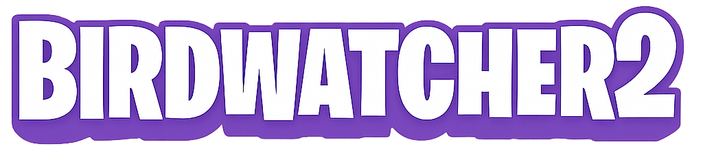

---

BirdWatcher2 is a live flight tracking web application that displays airplanes on an interactive map. Users can see planes flying near their location in real-time.

---

## Features

- Live airplane data that updates automatically every 10 seconds without refreshing
- Interactive map using Leaflet

---

## Tech

- **Frontend**: React, JavaScript
- **Maps**: Leaflet
- **Styling**: Bootstrap, CSS
- **API**: OpenSky Network API

---

### Prerequisites
Before running this project, make sure you have:
- [**Node.js**](https://nodejs.org/)

---

## Installation

1. Clone the GitHub repository
2. Open the project folder in VSCode
3. Open terminal in the project folder
4. Run: `npm install`
5. Run: `npm run dev`
6. Open the link in the terminal or manually go to: `http://localhost:5173` on your browser

---

## Authors
- **Nils Norén** - [@nilsnoren99](https://github.com/nilsnoren99)
- **Simon Sjöholm** - [@simon8056](https://github.com/simon8056)
- **Wilmer Nordblad Lundin** - [@Ih4z](https://github.com/Ih4z)

---

## Varför React? (Och inte Vue eller Angular, t.ex?)

Vi valde React ganska tidigt i projektet, främst för att det är ett ramverk som vi alla tre redan har erfarenhet av. Det gjorde att vi snabbt kunde komma igång och fokusera på att börja jobba direkt snarare än att först behöva lära oss ett nytt verktyg.

Eftersom vi är bekväma med Reacts struktur, kändes det naturligt att bygga gränssnittet med de komponenter vi behövde. Vi uppskattar även användningen av JSX, där vi kan skriva både HTML & JavaScript-kod i samma fil. För oss gör det koden mer smidig att arbeta med. Vue erbjuder en liknande struktur, men Reacts sätt att tänka passar oss bättre rent praktiskt. En annan stor fördel är React Hooks, där vi enkelt kunde samla vår logik i separata och återanvändbara funktioner, t.ex vid hantering av flygdatan eller API-anrop.

React har också en stor och aktiv community. Detta gör det enkelt att hitta hjälp och lösningar i dokumentation, olika forum & YouTube-videos. Det är dessutom ett av de mest använda frontend-ramverken i arbetslivet idag, vilket gör det extra relevant att ha erfarenhet av.

Vi är medvetna om att Vue hade kunnat fungera minst lika bra för ett mindre projekt som vårt, särskilt eftersom Vue också är nybörjarvänligt. I efterhand hade det kanske varit intressant att testa det. Varför vi uteslöt Angular direkt från början var genom en snabb googling då ingen av oss hade tidigare arbetat med det. Vi fick då snabbt reda på att Angular till mestadels är till för lite större och mer skalbara projekt. Enligt vår uppfattning hade det varit ett bättre alternativ för “företagsprojekt”, alltså inte passande för oss. Utöver detta använder Angular TypeScript som standard, och detta gjorde det ännu mer uppenbart att det inte var något som passade för vårt projekt.

I slutändan blev valet React tack vare våra tidigare erfarenheter, bra tillgång till resurser och dess relevans på arbetsmarknaden.

--- 

